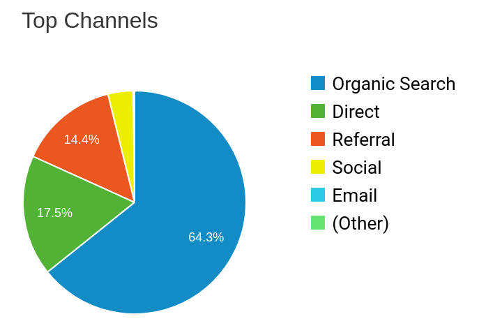

<!-- $theme: default -->

Relaunching Perl.com
====================

### Past, present and future

---

## Past

### A brief history of Perl.com

---

---

---

---

---

<!--

* 700+ articles written by Perl's finest
* by Larry, Damian, Allison Randal. Bryan Warnock "warnocked"
* State of the onion, Original Perl 6 design docs, Perl 6 Weekly newsletter
* chromatic left as site editor 2014
* No updates in 3 years
* Sadface

-->

---

## So sad

---

## "Present"

### June 2017 - June 2018

---

### TPC 2017

"Cheap" solution reading Perly::Bot feed of Perl community articles

---

* Convert Perl.com source to markdown-based
* Merge with PerlTricks.com
* New editor/writer
* Write contributing docs to get new authors
* Contact Perl companies for sponsored posts

---

### Restoration

* Tarball of Perl.com files
* Incomplete article index
* Embedded data
* No consistent path
* Duplicates

---

---

* 712 Perl.com articles converted to markdown
* 266 PerlTricks.com articles ported (2013-2017)
* Categories, tags, search
* New design
* Social media integration
* Hosted on GitHub

---

## github.com/tpf/perldotcom

---

### Since Relaunch (Dec 2017)

* Sysadmins: Ask Bjoern-Hansen & Robert Spier
* brian d foy co-editor
* 35 new articles

---

First time authors:
  - Andrew Shitov
  - Dawn Wallis
  - Elizabeth Mattijsen
  - Felipe Gasper
  - Kivanc Yazan
  - Mohammad S Anwar
  - Nadim Khemir
  - Samuel Andras
  - Sawyer X

---

Repo contributors:
 - Dave Cross
 - Dave Rolsky
 - Ed J
 - JRW
 - Jim Keenan
 - Jon Frost
 - Luca Buchala
 - Nour eddin M.
 - Skye Shaw
 - Tim Heaney

---

### Last 12 Months Comparison

<!--

* 47% increase in pageviews (270k)
* 17% increase in users (140k)
*  5% decrease in bounce rate (84%)

-->
---

### Most popular articles

1. Perl command line options (2004 - Dave Cross)
2. Beginning Perl (2000 - Doug Sheppard)
3. A short guide to DBI (1999 - MJD)
4. An open letter to the Perl Community (2018 - Liz Mattijsen)
5. Perl and LWP (2002 - Sean M Burke)

<!--

* 3 of the top ten articles have "beginning" in the title

-->
---

### Channels

---

### Comparing legacy and modern article pageviews

#### Legacy

#### Modern

---

## Future

---

### Objective: more pageviews

<!--

* Pageviews are a proxy for popularity
* Promote Perl
* Community growth

-->
---

To get more pageviews we need to:

1. Publish more popular articles
2. Publish more frequently
3. Keep visitors for longer

---

### More popular articles

* More beginner topics
* Mine adwords for popular search topics (for "bounties")

---

### Publish more frequently

* Ask for help more
* Better contributing docs
* Recognition & rewards
* Corporate sponsorship for article "bounties"

---

### Keep visitors for longer

* "You may also like ..."
* Archive page

---

## THANK YOU

<!--

* That's what we're planning to work on
* We need YOUR help to make this work
* Please contact me if you'd like to contribute

-->
